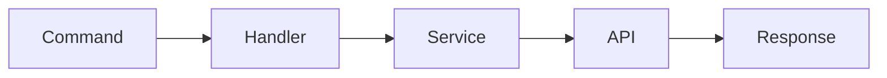
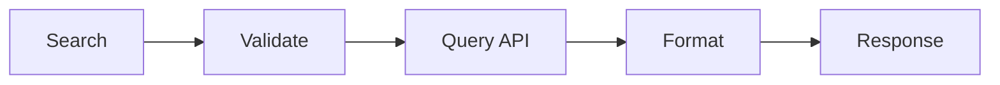
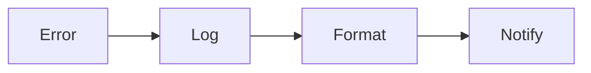

# Cấu trúc Dự án Bot Pháp Lý

## Thư mục Gốc
```
legal-bot/
├── src/                    # Mã nguồn chính
│   ├── core/              # Core functionality
│   ├── services/          # Các dịch vụ
│   ├── handlers/          # Xử lý commands
│   └── utils/             # Tiện ích
├── data/                  # Dữ liệu
├── tests/                 # Unit tests
└── docs/                  # Tài liệu
```

## Chi tiết Cấu trúc

### src/core/
```
core/
├── __init__.py
├── bot.py                # Bot chính
├── mock_api.py          # Mock API cho testing
└── logger.py            # Logging system
```

### src/services/
```
services/
├── __init__.py
├── document_service.py   # Xử lý văn bản pháp luật
├── news_service.py      # Xử lý tin tức
└── term_service.py      # Xử lý thuật ngữ
```

### src/handlers/
```
handlers/
├── __init__.py
├── command_handler.py    # Xử lý lệnh bot
├── search_handler.py     # Xử lý tìm kiếm
└── error_handler.py      # Xử lý lỗi
```

### src/utils/
```
utils/
├── __init__.py
├── formatter.py         # Format kết quả
└── validator.py        # Kiểm tra đầu vào
```

### data/
```
data/
├── legal_terms/         # Thuật ngữ pháp lý
│   ├── civil.json      # Dân sự
│   ├── criminal.json   # Hình sự
│   └── business.json   # Doanh nghiệp
└── cache/              # Cache dữ liệu
```

### tests/
```
tests/
├── __init__.py
├── test_bot.py
├── test_api.py
└── test_handlers.py
```

### docs/
```
docs/
├── api/                # Tài liệu API
├── guides/            # Hướng dẫn sử dụng
└── development/       # Tài liệu phát triển
```

## Các Module Chính

1. Bot Core
```python
class LegalBot:
    """Bot Telegram chính"""
    def __init__(self):
        self.api = MockLegalAPI()
        self.logger = setup_logger()

    async def start(self):
        """Khởi động bot"""
        pass

    async def handle_command(self, command):
        """Xử lý lệnh"""
        pass
```

2. Document Service
```python
class DocumentService:
    """Xử lý văn bản pháp luật"""
    def search(self, keyword):
        """Tìm kiếm văn bản"""
        pass

    def get_latest(self):
        """Lấy văn bản mới"""
        pass
```

3. News Service
```python
class NewsService:
    """Xử lý tin tức"""
    def get_latest_news(self):
        """Lấy tin mới"""
        pass

    def search_news(self, keyword):
        """Tìm kiếm tin"""
        pass
```

4. Term Service
```python
class TermService:
    """Xử lý thuật ngữ"""
    def search_term(self, term):
        """Tìm kiếm thuật ngữ"""
        pass

    def get_all_terms(self):
        """Lấy danh sách thuật ngữ"""
        pass
```

## Quy trình Làm việc

1. Xử lý Command


2. Xử lý Tìm kiếm


3. Xử lý Lỗi


## Yêu cầu Hệ thống

- Python 3.8+
- python-telegram-bot
- aiohttp
- python-dotenv

## Triển khai

1. Development
```bash
# Cài đặt dependencies
pip install -r requirements.txt

# Chạy bot
python src/core/bot.py
```

2. Testing
```bash
# Chạy tests
pytest tests/
```

3. Production
```bash
# Cấu hình môi trường
export TELEGRAM_TOKEN=your_token

# Chạy bot
python src/core/bot.py
```

## Monitoring

1. Logging
- Ghi log vào file
- Console output
- Error tracking

2. Metrics
- Số lượng request
- Thời gian phản hồi
- Tỷ lệ lỗi

3. Alerts
- Lỗi nghiêm trọng
- Quá tải hệ thống
- Token hết hạn

## Bảo mật

1. Input Validation
- Kiểm tra đầu vào
- Sanitize dữ liệu
- Rate limiting

2. Error Handling
- Xử lý exception
- Backup dữ liệu
- Rollback khi lỗi

3. Access Control
- Phân quyền user
- API authentication
- Audit logging
